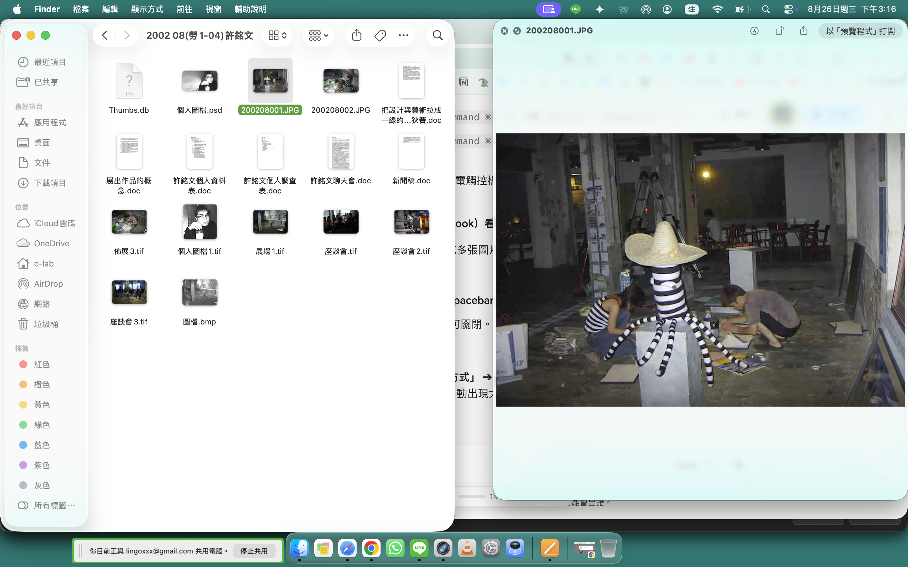
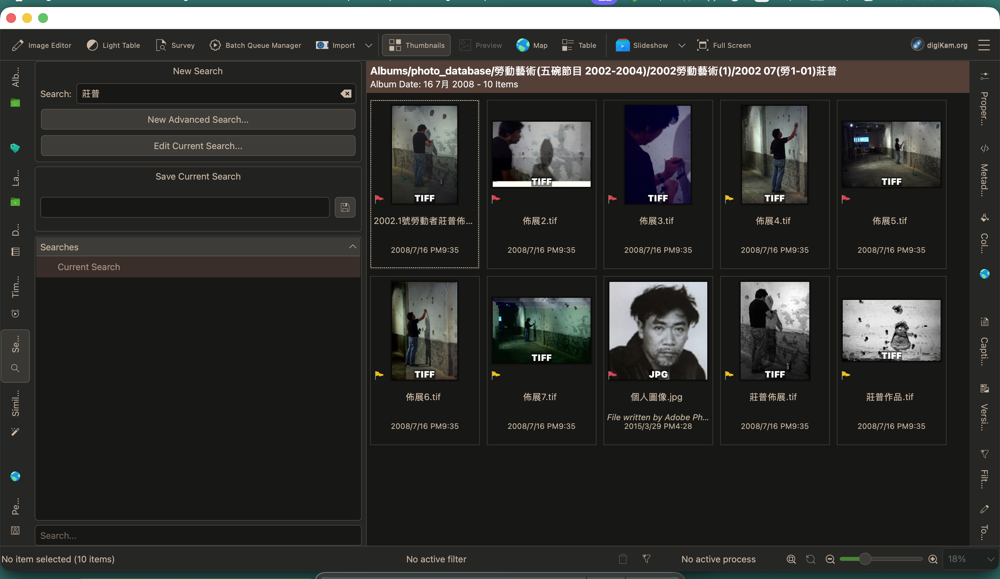
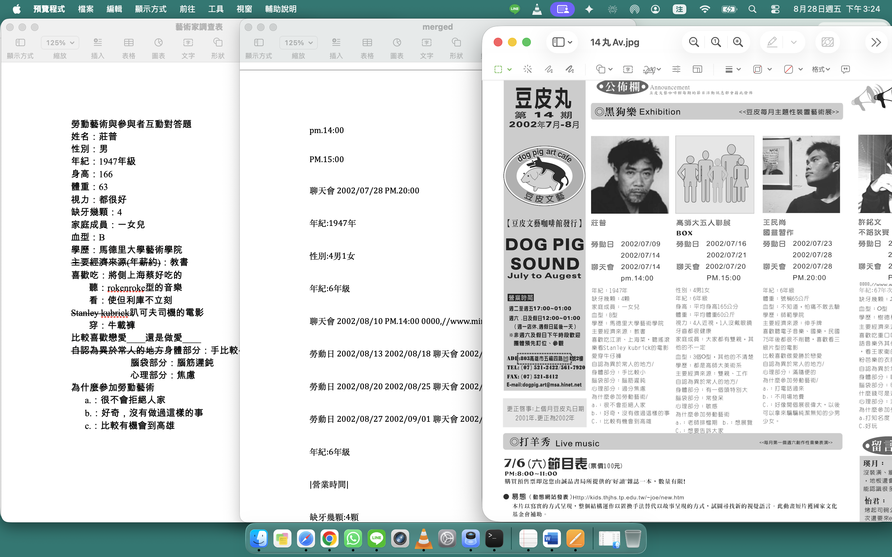
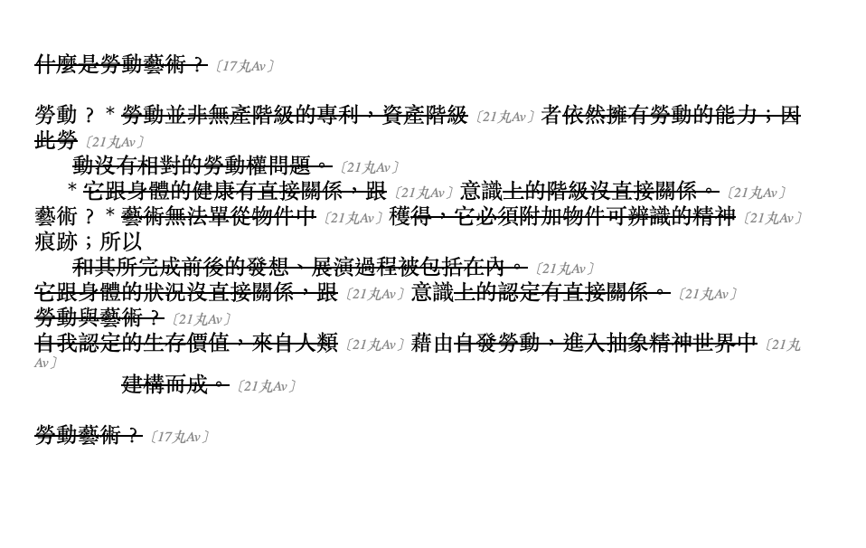

# 豆皮丸文藝咖啡館檔案數位化計畫
### Dogpig Archive Digitization Pipeline

高雄「豆皮文藝咖啡館」自 2000 年開始累積大量活動檔案，本專案意圖將這些跨媒材（文字、圖片、影片）檔案進行整理編修、建立標籤與自動化索引，並擴大檔案的近用性（accessibility）。

---

## 專案動機

這批檔案是研究豆皮文藝咖啡館早期藝術活動與勞動藝術節的第一手資料。原始素材包含：
* **文字刊物與文件**：包含直排與橫排混排的中文印刷體、手寫字跡與網點噪訊，對通用 OCR 工具而言是高難度素材。
* **歷史圖片與視覺紀錄**：包含大量展覽照片、活動紀錄圖檔，缺乏統一的元資料（Metadata）與檢索標籤。
* **影音檔案**：累積多個經過剪輯、轉碼、改變解析度或重覆備份的影片片段。

專案目標是建置一套完整且可擴充的數位資產管理 pipeline：將類比文件轉為可全文檢索的資料庫、以標籤管理圖片，並對影片進行內容指紋比對與查重。

<p align="center">
  <br>
  <sub>原始素材範例：豆皮文藝咖啡館 9/29 中秋 BBQ Party 活動傳單，圖文混排的活動宣傳品</sub>
</p>

<p align="center">
  <br>
  <sub>原始檔案庫的實際樣貌：掃描照片、舊版 Word 檔、TIFF 影像與影片等格式混雜</sub>
</p>

---

## 資料庫架構：三種檔案類型

原始檔案庫混雜圖片、文字文件、影片三種類型，依各自特性分別設計不同程度的自動化處理流程：

| 類型 | 處理方式 | 自動化程度 | 工具/技術 |
|---|---|---|---|
| **文字**（掃描頁面、Word 文件） | OCR 建立資料庫 → 跨文件重複內容比對與標註 | 高，全自動批次處理 | Google Drive API, Gemini VLM, `difflib` |
| **圖片** | digiKam 標籤化管理，OCR 關鍵字回寫入 Tags/Captions 供檢索 | 中，OCR 自動、標籤檢索為輔助 | digiKam, PaddleOCR |
| **影片** | 指紋比對與重複片段偵測（AI 影像與音訊指紋） | 高，批次自動偵測 | Video Duplicate Finder (VDF), DINOv2, FFmpeg |

---

## 開發歷程與技術細節

### 一、文字類檔案處理

#### 1. 本地端 OCR 嘗試（未達預期，調整定位）
* 嘗試用 **digiKam** 內建搜尋功能比對圖片內文字，發現該功能實際上只搜尋檔名／既有 metadata；後續改為「PaddleOCR 辨識關鍵字 → 回寫入 digiKam 的 Tags/Captions」，讓 digiKam 專注扮演標籤化管理與檢索介面的角色。
* 嘗試用 **PaddleOCR** 自建繁中辨識腳本處理文字類檔案，遇到套件安裝問題、大尺寸影像處理卡死（後引入 PIL 預先縮放解決）、以及文字編輯器把 `.py` 存成 RTF 格式導致語法錯誤等問題。
* *結論*：本地端傳統 OCR 引擎對這種網點噪訊 + 多欄位版面 + 直橫混排的舊印刷品辨識率過低，不符成本效益。

<p align="center">
  <br>
  <sub>digiKam 搜尋「莊普」：只比對到檔名／相簿路徑裡含有這個詞的檔案，並未真正辨識圖片內文字</sub>
</p>

#### 2. 雲端 OCR 與 Gemini 多模態模型轉向
* 測試將圖片上傳至 Google Drive 以「開啟為 Google 文件」觸發內建 OCR，辨識品質明顯優於本地端方案。使用 **Google Drive API** 將此流程自動化。
* 針對直橫混排版面（Google 文件會把直排文字錯誤攤平），改用 **Google Gemini 多模態模型**（Vision + 文字生成），透過 prompt 指定「保持正確閱讀順序、直排自動整理為橫向段落」。加入指數等待重試機制與模型版本管理以因應流量限制。

#### 3. 跨文件重複內容偵測
* 需求：把資料庫內容跟另一批獨立的 Word / 舊格式文件比對，找出重複段落並標註刪除線，且不得搬動或覆蓋原始檔案結構。
* 使用 `difflib` 演算法，經歷多次迭代：加入全形／半形標點與空白字元正規化，並建立「正規化字串 ↔ 原始文字位置」對照表（index map），確保去除干擾字元比對的同時，刪除線仍精準標註回原始文字座標；比對門檻可調整（目前慣用設定為 6 字元），在短欄位（如表單）與避免誤判常見詞之間取得平衡。
* 資料夾內若含 `.doc`／`.txt`／`.rtf` 等舊格式檔案，腳本會自動呼叫 macOS 內建 `textutil` 先轉為 `.docx` 再進行比對，原始檔案不受影響、不會被搬動或覆蓋。
* **標註出處**功能的設計本身也經過幾輪修正：一開始嘗試直接用正規表示式比對「11丸Av」「3丸B」這種編號寫法本身作為出處依據，但這類短字串太容易在別處誤判；改成直接比對 OCR 腳本合併資料庫時自動產生的標題格式「檔案：11丸Av.jpg」（`doc.add_heading(f"檔案：{filename}")`），並在辨識時自動去除副檔名，準確度大幅提升。過程中也發現資料庫最上層的大標題（如「豆皮丸辨識結果」）若沒排除，會被誤判成一種出處，因此額外加入「標題樣式段落一律不列入比對內容」的規則。
* **標註出處**：資料庫裡每份原始檔案在合併時都會加上「檔案：11丸Av.jpg」這樣的標題（OCR 腳本自動產生），比對到重複內容時，腳本會回頭找出這段文字對應資料庫裡的哪一份原始檔案，並在刪除線後面用灰色小字標註出處，例如「這段文字重複了〔11丸Av〕」；先用 `--list-sources` 預覽辨識到的出處清單且不修改任何檔案，確認無誤後再正式執行。
* 預設不再自動備份（跑完直接原地修改），需要保留 `.bak` 備份時另外加 `--backup` 參數——這個行為是根據實際使用習慣後續調整的，早期版本預設會自動備份。

<p align="center">
  <br>
  <sub>比對結果範例：重複段落精準標註刪除線</sub>
</p>

<p align="center">
  <br>
  <sub>標註出處範例：每處重複內容旁都以〔出處〕標示這段文字來自資料庫中的哪一份原始檔案，方便回溯查證</sub>
</p>

---

### 二、圖片與影片類檔案管理指南

本章節整合單位內部視覺影像（圖片與影片）的數位資產管理標準作業流程。

#### 1. digiKam 視覺資料庫基礎設定
* **安裝與相容性**：至 [digiKam 官網](https://www.digikam.org/) 下載安裝。macOS 使用者若為 Apple Silicon 晶片（M1/M2/M3/M4），下載第三方輔助工具時請優先選擇 **`arm64`** 版本以獲得最佳效能。
* **資料庫建立**：首次開啟時設定資料庫儲存路徑，將影音資料夾新增至集合（Albums）中，建議保持清晰的目錄結構（如：`年份_活動名稱`）。
* **PaddleOCR 關鍵字標籤寫入**：利用 PaddleOCR 批次掃描圖片文字後，將命中之關鍵字自動寫入 digiKam 的 **`Tags`（標籤）** 或 **`Captions`（圖說）** 中，實現高精確度的圖檔檢索。

#### 2. 已編輯影片之深度指紋查重 (Video Duplicate Finder)
針對經過裁切、轉碼、調色或剪輯的重複影片，常規 Hash 比對會失效，本專案採用 **Video Duplicate Finder (VDF)** 進行深度指紋比對：

* **環境依賴**：macOS 請先透過 Homebrew 安裝 `brew install ffmpeg`。下載 VDF 的 `GUI-osx-arm64.tar.gz` 版本。
* **核心設定與參數調整（避免誤判）**：
  1. **影像演算法 (Image Algorithm)**：切換為 **`DINOv2`**（Meta 開源之 AI 深度學習特徵模型），分析畫面內容結構與語意，避免只比對顏色或檔名。
  2. **畫面抽樣 (Frame Sampling)**：將 `Images per video` 提高至 **`15` ~ `30` 張**，增加抽樣密度以提高精確度。
  3. **音訊指紋 (Audio Fingerprint)**：勾選 **`Enable Audio Search / Chromaprint`**。若影片畫面被裁切但背景音/對白一致，此功能比對最為精準。
  4. **時間裁切 (Crop Time)**：設定忽略開頭與結尾前 5 秒（Ignore duration start / end），排除固定片頭或靜音區域干擾。

#### 3. 資料庫維護最佳實踐
* **元資料同步**：在 digiKam 中修改標籤與註解後，執行「將標籤寫入檔案（Write Metadata to Files）」，將資料直接儲存於檔案標頭（EXIF/XMP），確保檔案移至其他系統時標籤不遺失。
* **定期維護**：定期備份 digiKam 資料庫檔案（`digikam4.db`），並執行 VDF 影像查重以節省儲存空間。

---

## 技術重點

| 挑戰 | 解法 |
|---|---|
| 直橫混排版面辨識 | 改用多模態 VLM（Gemini）並精準設計 prompt 規則 |
| 全形/半形標點與空白干擾 | 一對一字元映射正規化，建立位置對照表（index map）還原原始座標 |
| 高解析度圖檔致 OCR 卡死 | 透過 PIL 預先縮減長邊至 1200px 以內，提升 5~10 倍辨識速度 |
| 編輯/剪輯過之重複影片比對 | 使用 VDF 搭配 DINOv2 AI 畫面模型與 Chromaprint 音訊指紋 |
| API 金鑰外洩風險 | 金鑰改以環境變數讀取，不寫死於程式碼中 |
| 舊格式檔案相容性 | 呼叫 macOS 內建 `textutil` 靜默轉檔，原始檔案不被觸碰 |
| 重複內容找不到原始出處 | 資料庫合併時保留每份原始檔案的標題，比對時回溯對應段落所屬來源並標註 |

## 技術棧

- **語言**：Python 3
- **OCR / 視覺模型**：Google Drive API, Google Gemini API (`google-genai`), PaddleOCR
- **影音處理與指紋辨識**：Video Duplicate Finder, DINOv2, Chromaprint, FFmpeg, digiKam
- **文件處理**：`python-docx`, `PIL` (Pillow)
- **文字比對**：`difflib`（Ratcliff/Obershelp 演算法）
- **開發環境**：macOS Terminal, VS Code

---

## 檔案結構

```
scripts/
├── 01_batch_ocr_merge.py         # 批次圖片 → Google Drive OCR → 合併 docx
├── 02_gemini_ocr.py              # Gemini 多模態 OCR，處理直橫混排版面
├── 03_mark_duplicates_new.py     # 跨文件重複內容偵測，標註刪除線並註明出處
└── search_paddle.py              # PaddleOCR 本地端關鍵字檢索與標籤提取腳本（歷史參考，見下方說明）
```

### 使用方式

```bash
# 1. 批次 OCR（Google Drive，適合橫排為主的版面）
python3 scripts/01_batch_ocr_merge.py "圖片資料夾路徑" --output merged.docx

# 2. 批次 OCR（Gemini VLM，適合直橫混排版面）
export GEMINI_API_KEY="your_api_key"
python3 scripts/02_gemini_ocr.py

# 3. 跨文件重複內容比對與標註（先預覽出處清單，不會修改任何檔案）
python3 scripts/03_mark_duplicates_new.py "要標註的資料夾" --database "merged.docx" --list-sources
# 確認無誤後正式執行
python3 scripts/03_mark_duplicates_new.py "要標註的資料夾" --database "merged.docx"

# 4. 本地端圖片關鍵字檢索（PaddleOCR，僅供小量測試參考，正式流程建議使用步驟 1-2 的雲端 OCR）
python3 scripts/search_paddle.py
```

執行前需準備：
- Google Cloud 專案並啟用 Drive API，下載 OAuth `credentials.json`（腳本內附設定步驟）
- Gemini API 金鑰（[Google AI Studio](https://aistudio.google.com/apikey) 免費取得）

---

## 反思

這個專案的每一個轉折——從 digiKam 到 PaddleOCR 到 Google 文件、再到 Gemini VLM 與 VDF 影音指紋——都是先以最低成本的方式手動測試可行性，確認品質後才投入自動化。這種「先驗證、後規模化」的工作方式，某種程度上也反映了策展與檔案數位化工作中常見的判斷邏輯：先理解材料的特性與限制，再決定用什麼方式保存與呈現它。

---

## License

MIT License — 程式碼可自由使用、修改；原始檔案內容（豆皮文藝咖啡館刊物）版權歸原權利人所有，不在此授權範圍內。
